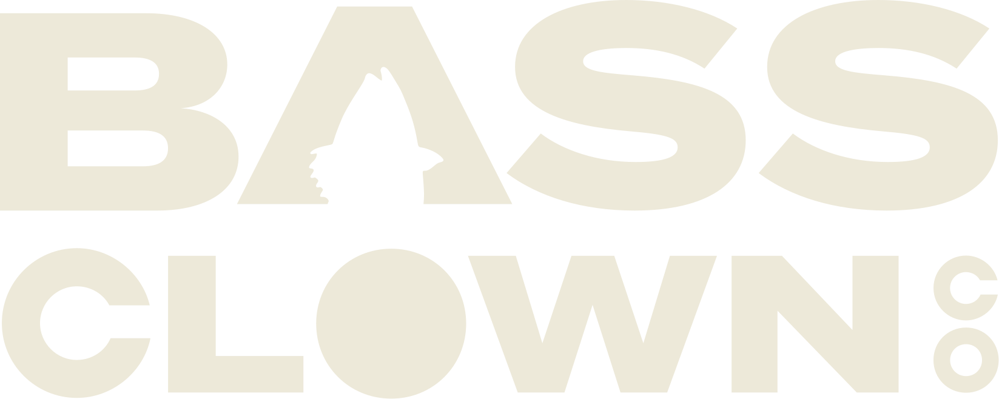

# Bass Clown Co

<p align="center">
  
</p>

## 🎬 Overview

Bass Clown Co is a specialized media company focusing on the fishing industry, creating engaging video content that catches attention "just like the perfect lure." This Next.js website showcases Bass Clown Co's professional video production services while maintaining a unique brand identity that blends humor with professional content.

Our mission: To create memorable fishing industry content that stands out in a crowded media landscape with a "heavy dose" of humor.

### Target Audience
- Fishing brands and manufacturers looking for video production
- Outdoor equipment companies
- Fishing tournaments and events
- Professional anglers seeking brand development

## 🚀 Features

### Public Features
- **Professional Design**: Fishing-themed user interface with film strip accents and branded elements
- **Service Showcase**: Detailed information on various video production services
- **Portfolio Display**: Examples of past work with filtering capabilities
- **Interactive Elements**: Animations, polaroid-style images, and engaging visuals
- **Contact System**: Form for potential clients to reach out
- **Responsive Layout**: Mobile-friendly design that works on all device sizes
- **Blog Section**: Space for industry insights and company updates
- **Store Section**: E-commerce integration for branded merchandise

### User Dashboard Features
- **User Authentication**: Secure login/registration with email verification
- **User Dashboard**: Comprehensive user profile and account management
- **Contest System**: Create, apply to, and manage video contests
- **Giveaway System**: Enter giveaways and track entries
- **Points System**: Earn and spend points on platform activities
- **Subscription Management**: Handle Pro and Premium subscriptions with Stripe
- **File Upload**: Upload images and videos with Vercel Blob integration
- **Billing History**: Track payments and subscription details

### Admin Features
- **Admin Dashboard**: Comprehensive admin panel for platform management
- **User Management**: Manage all platform users and their roles
- **Contest Management**: Create and oversee contests with judging capabilities
- **Giveaway Management**: Set up and manage giveaways with automated winner selection
- **Analytics**: Detailed platform analytics and reporting
- **Brand Management**: Tools for managing brand partnerships and collaborations

### Brand Features
- **Brand Dashboard**: Specialized interface for brand partners
- **Contest Creation**: Create branded contests for content creators
- **Analytics**: Track brand-specific metrics and engagement
- **Collaboration Tools**: Manage partnerships with creators

## 🛠️ Technical Stack

- **Framework**: [Next.js 15](https://nextjs.org/) with App Router architecture
- **Language**: [TypeScript](https://www.typescriptlang.org/)
- **Database**: [Neon PostgreSQL](https://neon.tech/) with [Drizzle ORM](https://orm.drizzle.team/)
- **Authentication**: [NextAuth.js](https://next-auth.js.org/) with credentials provider
- **Styling**: [TailwindCSS](https://tailwindcss.com/)
- **Package Manager**: [Bun](https://bun.sh/)
- **UI Components**: [Radix UI](https://www.radix-ui.com/) with shadcn/ui implementation
- **Form Validation**: [React Hook Form](https://react-hook-form.com/) with [Zod](https://github.com/colinhacks/zod)
- **Email Service**: [Resend](https://resend.com/)
- **Payment Processing**: [Stripe](https://stripe.com/)
- **File Storage**: [Vercel Blob](https://vercel.com/docs/storage/vercel-blob)
- **Animation**: TailwindCSS Animate and custom CSS animations
- **Icons**: [Lucide React](https://lucide.dev/)

## 📁 Project Structure

```
bass-clown-co-next/
├── app/                           # Next.js App Router pages
│   ├── (authenticated)/           # Protected routes requiring login
│   │   ├── (brand)/               # Brand-specific pages
│   │   │   ├── analytics/
│   │   │   ├── brand/
│   │   │   ├── brand-contests/
│   │   │   └── profile/
│   │   ├── admin/                 # Admin-only pages
│   │   │   ├── analytics/
│   │   │   ├── brands/
│   │   │   ├── contests/
│   │   │   ├── creators/
│   │   │   ├── giveaways/
│   │   │   ├── reports/
│   │   │   └── users/
│   │   ├── contests/              # Contest management
│   │   ├── dashboard/             # User dashboard
│   │   │   ├── billing/
│   │   │   ├── giveaways/
│   │   │   ├── points/
│   │   │   ├── profile/
│   │   │   └── settings/
│   │   ├── my-contests/           # User's contests
│   │   └── my-entries/            # User's entries
│   ├── (unauthenticated)/         # Public routes
│   │   ├── about/
│   │   ├── blog/
│   │   ├── contact/
│   │   ├── content-contests/
│   │   ├── giveaways/
│   │   ├── login/
│   │   ├── register/
│   │   ├── services/
│   │   └── store/
│   ├── api/                       # API routes
│   │   ├── auth/                  # Authentication endpoints
│   │   ├── contests/              # Contest management
│   │   ├── giveaways/             # Giveaway management
│   │   ├── upload/                # File upload endpoints
│   │   └── webhooks/              # External service webhooks
│   ├── globals.css                # Global styles
│   ├── layout.tsx                 # Root layout component
│   └── page.tsx                   # Homepage
├── components/                    # Reusable components
│   ├── admin/                     # Admin-specific components
│   ├── brand/                     # Brand-specific components
│   ├── contests/                  # Contest-related components
│   ├── dashboard/                 # Dashboard components
│   ├── giveaways/                 # Giveaway components
│   ├── home/                      # Homepage-specific components
│   ├── ui/                        # Shadcn UI components
│   └── w9/                        # Tax form components
├── drizzle/                       # Database migrations
├── hooks/                         # Custom React hooks
├── lib/                           # Utility functions and constants
│   ├── db/                        # Database configuration and schema
│   │   ├── index.ts               # Database connection
│   │   └── schema.ts              # Database schema definitions
│   ├── actions.ts                 # Server actions
│   ├── auth-config.ts             # NextAuth.js configuration
│   ├── constants.ts               # Site-wide constants
│   ├── stripe.ts                  # Stripe configuration
│   ├── types.ts                   # TypeScript type definitions
│   └── utils.ts                   # Utility functions
├── migrations/                    # SQL migration files
├── scripts/                       # Setup and utility scripts
└── public/                        # Static assets
    └── images/                    # Image assets
        └── assets/                # Additional image assets
```

## 🚦 Getting Started

### Prerequisites

- Node.js 18.17.0 or later
- Bun package manager
- Git

### Environment Variables

Before running the application, you'll need to configure the following environment variables. Create a `.env.local` file in the root directory:

#### 🗄️ Database Configuration
- `DATABASE_URL` - Neon PostgreSQL database connection string for storing application data

#### 🔐 Authentication & Security
- `JWT_SECRET` - Secret key for signing JWT tokens used in authentication
- `NEXTAUTH_SECRET` - Secret key for NextAuth.js session encryption and security
- `W9_ENCRYPTION_KEY` - Encryption key for securing W9 tax form data

#### 📧 Email Service (Resend)
- `RESEND_API_KEY` - API key for Resend email service for transactional emails
- `SEND_EMAILS_TO` - Email address where contact form submissions are sent
- `SEND_EMAILS_FROM` - From address for outgoing emails (default: Contact Form <onboarding@resend.dev>)

#### 💳 Payment Processing (Stripe)
- `STRIPE_SECRET_KEY` - Stripe secret key for processing payments and subscriptions
- `STRIPE_WEBHOOK_SECRET` - Secret for verifying incoming Stripe webhook events
- `STRIPE_PRO_PRICE_ID` - Stripe price ID for the Pro subscription tier
- `STRIPE_PREMIUM_PRICE_ID` - Stripe price ID for the Premium subscription tier

#### 🌐 Application Configuration
- `NEXT_PUBLIC_BASE_URL` - Public base URL of your application (e.g., https://bassclownco.com)

> **Note**: Variables prefixed with `NEXT_PUBLIC_` are exposed to the browser. All other variables are server-side only.

### Installation

1. Clone the repository
   ```sh
   git clone https://github.com/davidsolheim/bass-clown-co-next.git
   cd bass-clown-co-next
   ```

2. Install dependencies
   ```sh
   bun install
   ```

3. Set up environment variables
   ```sh
   # Create .env.local file with your actual values
   # See Environment Variables section below for required variables
   ```

4. Set up the database
   ```sh
   bun run create-admin
   ```

5. Start the development server
   ```sh
   bun dev
   ```

6. Open your browser and navigate to http://localhost:3000

### Available Scripts

- `bun dev` - Start the development server
- `bun run build` - Build the application for production
- `bun start` - Start the production server
- `bun lint` - Run ESLint to check code quality
- `bun run create-admin` - Set up the database and create an admin user

## 🔍 Key Components

### Page Components

- **Hero (`components/home/Hero.tsx`)**: Main landing section with compelling visuals and call-to-action
- **MediaCompanySection**: Explains the company's unique approach to media production
- **ServicesSection**: Showcases the variety of services offered
- **FishStoriesSection**: Engaging content about fishing narratives
- **PartnersSection**: Display of partner brands and collaborators
- **CTASection**: Call-to-action for potential clients

### Reusable Components

- **Header**: Navigation and branding for the site
- **Footer**: Site-wide footer with contact information and social links
- **ProjectCard**: Card display for portfolio items
- **ServiceBlockCard**: Display for service offerings
- **ContactForm**: Form for user inquiries using React Hook Form and Zod validation

## 🎨 Styling and Customization

### Theme Configuration

The site uses TailwindCSS for styling with a custom configuration defined in `tailwind.config.ts`. Key customizations include:

- Custom color scheme with fishing and film-related themes
- Extended typography options including a handwriting font
- Animation configurations for interactive elements
- Responsive design breakpoints

### Adding New Content

#### To Add a New Service:

1. Update the `SERVICE_BLOCKS` array in `lib/constants.ts`
2. Add required assets to the `public/images/assets/` directory
3. (Optional) Create a dedicated page in the `app/services/` directory

#### To Add a New Project:

1. Update the `PROJECTS` array in `lib/constants.ts`
2. Add project images to the `public/images/` directory

## 📊 Data Structure

The project uses TypeScript interfaces defined in `lib/types.ts` for structured data:

- **ServiceBlock**: Represents a service offering with title, description, and visual elements
- **NavItem**: Navigation menu items
- **Service**: Detailed service information
- **Project**: Portfolio project information
- **SocialLink**: Social media platform links
- **ContactFormValues**: Structure for contact form submissions

## 📝 Development Guidelines

### Code Style

- Use TypeScript for all components and functions
- Follow Next.js best practices for App Router implementation
- Implement client-side interactivity with the "use client" directive
- Maintain responsive design for all components
- Use Tailwind utility classes for styling
- Use semantic HTML elements for accessibility

### Component Organization

- Place page-specific components in the `app` directory
- Keep reusable components in the `components` directory
- Organize home page sections in the `components/home` directory
- Store UI components from shadcn/ui in the `components/ui` directory

## 🌐 Deployment

### Build for Production

```sh
bun run build
```

The output will be in the `.next` directory ready for deployment.

### Deployment Options

- **Vercel (Recommended)**: Connect your GitHub repository for automatic deployment
- **Netlify**: Use the Next.js build plugin
- **Custom Server**: Deploy the built application to your server

## 🤝 Contributing

We welcome contributions to improve Bass Clown Co's website!

### Contribution Process

1. Fork the repository
2. Create a feature branch (`git checkout -b feature/amazing-feature`)
3. Commit your changes (`git commit -m 'Add some amazing feature'`)
4. Push to the branch (`git push origin feature/amazing-feature`)
5. Open a Pull Request

### Coding Standards

- Write clean, readable code with appropriate comments
- Maintain TypeScript typing for all components and functions
- Test components on multiple device sizes
- Ensure accessibility standards are met

## 📚 Resources & Documentation

- [Next.js Documentation](https://nextjs.org/docs)
- [TypeScript Documentation](https://www.typescriptlang.org/docs/)
- [TailwindCSS Documentation](https://tailwindcss.com/docs)
- [React Hook Form Documentation](https://react-hook-form.com/get-started)
- [Radix UI Documentation](https://www.radix-ui.com/docs/primitives/overview/introduction)
- [Bun Documentation](https://bun.sh/docs)

## 📄 License

This project is licensed under the MIT License - see the LICENSE file for details.

## 📬 Contact

Bass Clown Co - [info@bassclown.com](mailto:nick@bassclown.com)

---

<p align="center">Created with 🎣 by Solheim Technologies</p>
